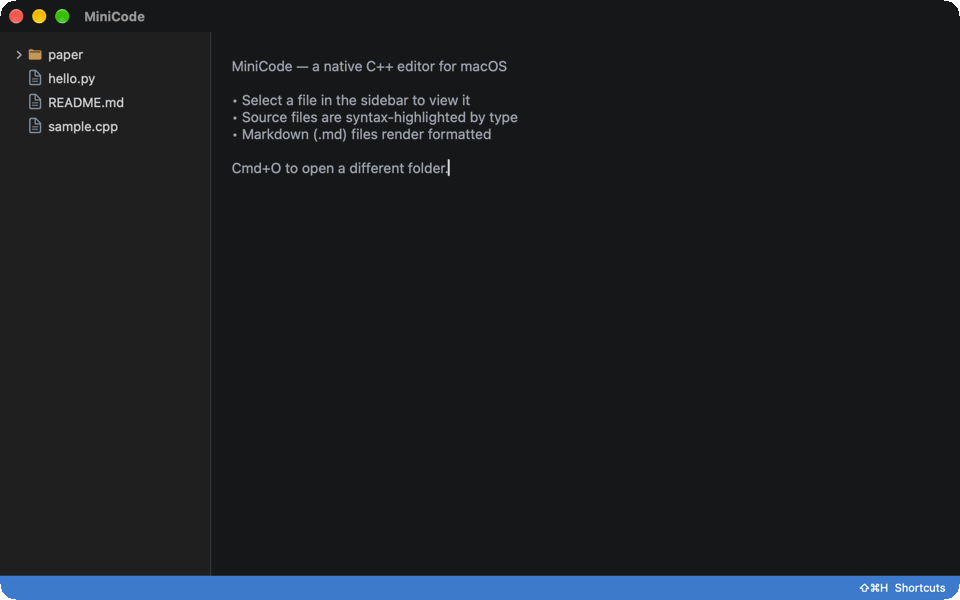
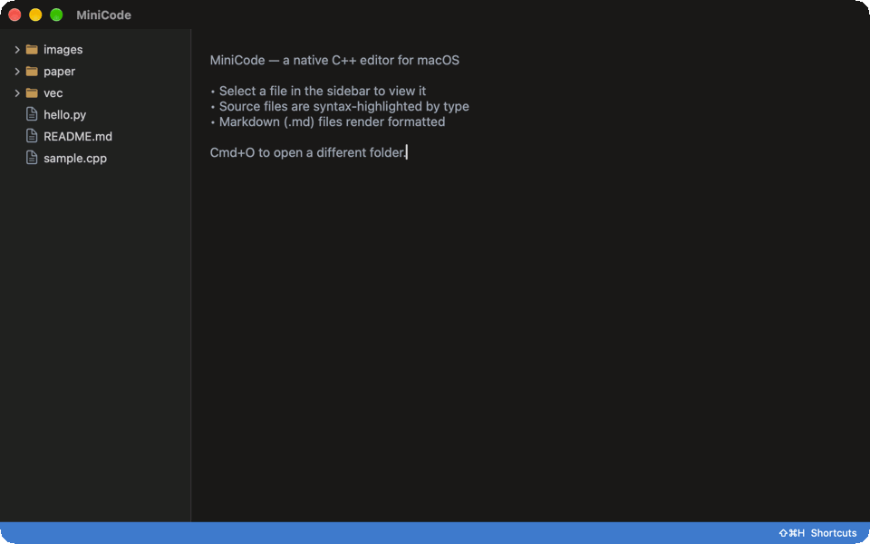
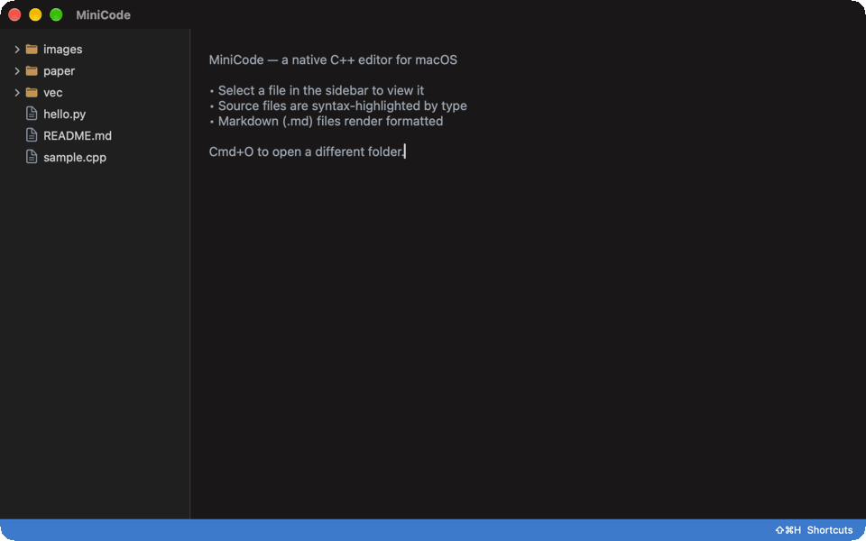
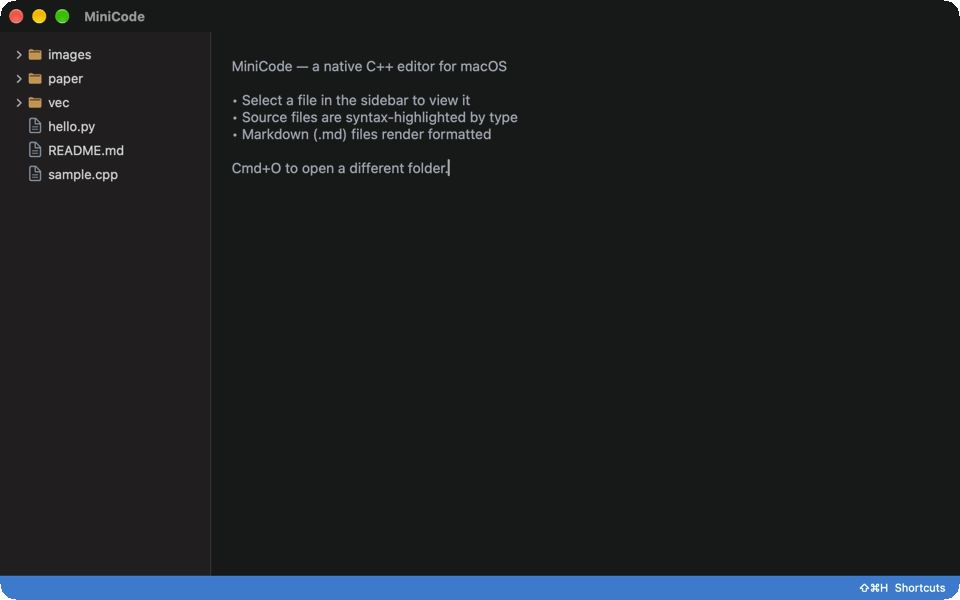
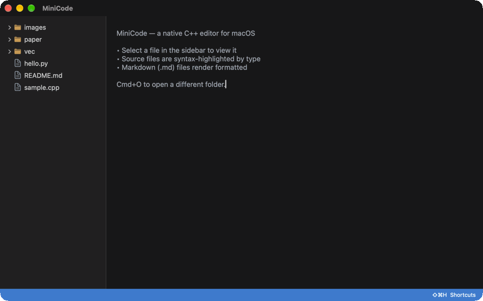
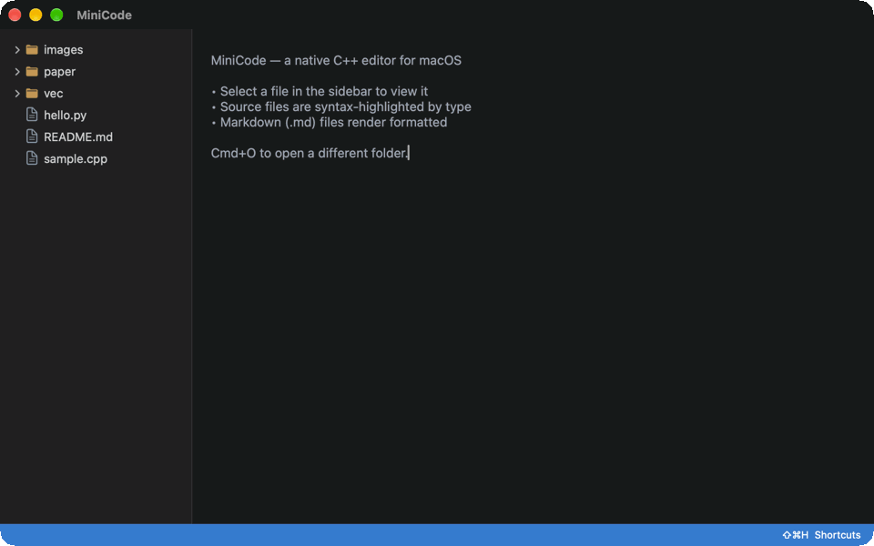
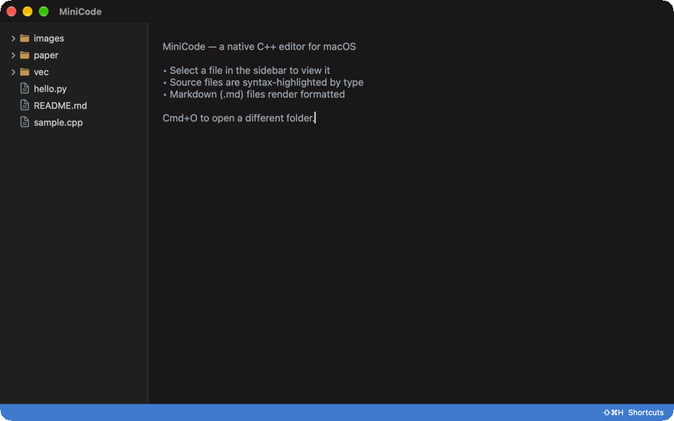
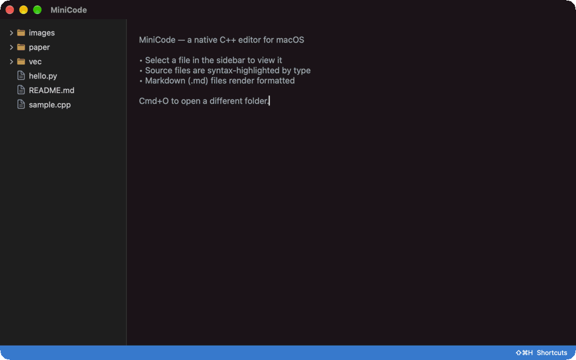

# MiniCode

MiniCode is a small IDE for macOS, Linux and Android, written from scratch in C++ with no Electron and no third-party dependencies. The macOS app is C++ and Objective-C++, and it links only against frameworks that ship with the operating system (Cocoa, WebKit, PDFKit, CoreServices) and the system zlib. The compiled binary is about 1 MB. The Linux version is a GTK4 port and the Android version is a Kotlin app, both sharing that same C++ core; the [Linux](#linux) and [Android](#android) sections say what each covers so far. The rest of this README describes the macOS app.

I built it because I wanted one light place to browse a folder, edit code with a language server behind it, preview Markdown and LaTeX, and keep a terminal and a browser a keystroke away, without a few hundred megabytes of runtime underneath.



Clicking through the demo folder: the README rendered, then shown as source with Shift Command P, a line added to hello.py and saved, and then sample.cpp.

## What it does

You open a folder and get a file tree on the left, much like the explorer in VS Code. Click a file and it opens in the main pane. The tree watches the folder with FSEvents, so a file you create, rename or delete somewhere else (in the built in terminal, in git, in another program) shows up on its own within a moment. Right click an item for new file, new folder, rename, move to trash, reveal in Finder, or copy its full path; the File menu has the same items.

Source files are highlighted by extension, so Python, C, C++, Objective-C, JavaScript, TypeScript, JSON, shell scripts and a handful of others get colored keywords, strings, comments and numbers. Markdown renders as formatted text in the window, and you can flip to the raw source to edit it. LaTeX is typeset to a PDF in the same pane, and you can edit the document by double clicking text on the page.

Images (PNG, JPEG, GIF, HEIC, WebP, TIFF and the like) open in that pane too. They are scaled down to fit but never enlarged past their real size, and the title bar shows their pixel dimensions. Animated GIFs play. PDFs open there as scrolling pages you can zoom and select text from. If the file is rewritten while it is open, say by running tectonic in the terminal, it reloads on the same page when you come back to the window.



Opening the app icon from the images folder, shown at its real size with its pixel dimensions in the title bar, and then a PDF, which scrolls and zooms in place of the editor.

Type into a file and the highlighting follows as you go. Command S saves, undo and redo work as usual, and the title bar shows a dot while you have unsaved changes.

Control backtick pulls up a terminal at the bottom, and you can drag the bar above it to resize it. It runs one persistent zsh session on a real pseudo terminal with your own startup files loaded, so your aliases and functions are there and state carries from one command to the next. Output streams in as it is printed, Control C interrupts, and programs that ask for input get it; a password prompt switches the input line to hidden text. A command that fails shows its exit status underneath. The up and down arrows walk your history, and a click anywhere in the panel puts the cursor on the input line. Colors come through, so git, ls and test runners look the way they do in any other terminal, and progress lines that redraw themselves update in place.

Ordinary output stays as a scrolling log you can select and copy from. When a program wants the whole screen (vim, less, man, htop, git log with its pager, a Python prompt, an ssh session), the panel switches to a character grid for as long as the program runs, and your keys go straight to it: arrows, Tab, Escape, the function keys, Control letters, and Option as Meta. Command shortcuts still reach the menus, so Command C copies a selection you drag in the grid and Command V pastes. When the program exits, the log comes back as you left it.

Shift Command B toggles a browser panel, a WebKit view with a URL bar and back, forward and reload buttons.



The terminal under a Python file, running ls, git log and the script itself, with the colors each command prints.



Vim in the terminal panel on the character grid. A short list is typed and saved with :wq, and the panel goes back to the log with the same shell, where cat shows the file. Then git log opens in its pager, Space turns the page and q quits.

Paths and URLs in the output are links. Hold Command and click one, such as src/main.cpp:42:7 from a compiler or a file Claude Code mentions, and the file opens at that line and column; a URL opens in the browser panel. It works in the full screen grid too. Only paths that exist, relative to the shell's current folder or the project, count as links.



grep finds a function, and Command clicking hello.py:9 opens the file at that line. Then Command clicking a URL printed in the terminal opens it in the browser panel.

If you forget a shortcut, Shift Command H opens a small panel listing the ones that apply right now. The preview toggle, for instance, only appears there when a Markdown or LaTeX file is open.

## LaTeX

Open a .tex file and MiniCode typesets it and shows the PDF where the editor sits. Shift Command P flips between the page and the source, as it does for Markdown. The document is typeset again after every change, which takes well under a second for a short paper.

You can also edit from the page. Double click a piece of text on it (a title, a heading, a sentence, a table cell, a list entry, an equation) and a small editor opens holding the LaTeX that produced it. Change it and press Return, and that text is replaced in your document and the page is typeset again. Inside a list, the editor also offers to add an entry, which writes a new item after the one you clicked, indented to match its neighbours. Text inside italics, bold, links and your own macros can be clicked the same way, and so can words with accents or ligatures and words TeX hyphenated across two lines. If MiniCode cannot tell which piece of source a word came from, it opens nothing, since opening the wrong text would be worse.



Double clicking a list entry in the PDF, rewriting it, and pressing Return. The page is typeset again, and Shift Command P shows the edit in the source.

What you type in that editor is LaTeX, so you can write \\emph{like this}, and a stray percent sign or ampersand needs its backslash as it would anywhere else. An edit replaces only the bytes of the piece you clicked. The document is never regenerated from a model of it, so macros, packages and anything else MiniCode does not understand are left alone. Edits mark the buffer as changed, like typing does, and nothing is written to disk until you press Command S.

Typesetting is done by [tectonic](https://tectonic-typesetting.github.io/), a single binary TeX engine, which MiniCode uses the same way it uses language servers you already have. If tectonic is installed, MiniCode finds it. If not, the preview says so and offers to download the official build, about 22 MB, into ~/Library/Application Support/MiniCode. You can also install it yourself with brew install tectonic. The first document you typeset downloads the LaTeX packages it needs, roughly 40 MB for an ordinary paper, and tectonic keeps them, so after that it works offline.

To keep the typeset document, press Shift Command S or choose Export PDF from the File menu, and pick where to save it. You get exactly what tectonic produced for the document as it stands in the editor, unsaved edits included. If the preview is behind what you have typed, or you are looking at the source, it is typeset first. Exporting does not save your .tex file; Command S still does that.

While it previews, MiniCode typesets a hidden copy of the buffer next to your file, named like .paper.minicode.tex, so that \\input and \\includegraphics still find their files and your own file is never written behind your back. The copy is deleted as soon as tectonic finishes.

## Language servers

If you have a language server installed, MiniCode gives you completion, go to definition and error underlines as you type. It implements only the Language Server Protocol client; the servers are separate programs, as tectonic is for LaTeX. It knows these out of the box: clangd for C, C++ and Objective-C (it comes with the Xcode command line tools), pyright or pylsp for Python, gopls for Go, rust-analyzer for Rust, and typescript-language-server for JavaScript and TypeScript. It looks for them on your PATH and in the usual Homebrew, Cargo and Go folders, because an app started from the Dock gets a much shorter PATH than your shell does.

Open a file and its server starts in the background, rooted at the folder the window has open. Problems get a squiggly underline, red for errors and yellow for warnings, and resting the pointer on one shows the message. The status bar names the running server and counts the file's errors and warnings. Typing a dot, an arrow or a double colon opens a completion list, and Control Space opens it anywhere. The arrows move through it, Return or Tab takes an item, and Escape closes it. F12, or Command click on a name, jumps to its definition, in another file if that is where it lives. Command I shows the type and documentation of whatever is under the cursor.



clangd on a small C++ example. Typing p. opens the completion list, and taking lengthSquared without its parentheses gets a red underline and an error count in the status bar. Command I explains the error, adding the parentheses clears it, and on scaled Command I shows the comment from the header before F12 jumps there.

If a language has no server installed, the only sign is a short note in the status bar. You can pick a different server or turn one off in the settings file, for example lsp.python = pylsp or lsp.go = off, and lsp.enabled = false turns the whole thing off. Servers shut down when their window closes and when MiniCode quits.

## Settings and transparency

Command comma opens the settings file, ~/.config/minicode/settings.conf. The first time, MiniCode writes it with every setting listed, commented out and set to its default, so you can see what exists and uncomment what you want. Changes apply as soon as the file is saved, in MiniCode or any other editor, and every open window picks them up.

Each part of the window (the title bar, the file tree, the editor, the terminal, the browser toolbar and the status bar) has its own background color, opacity and text color. Opacity applies only to the background, so text stays solid while whatever is behind the window shows through. window.opacity sets every panel at once, and a panel's own opacity overrides it. window.blur frosts what is behind the window, as the macOS sidebar and Terminal do, which keeps text readable over a busy desktop. The syntax colors and the Markdown heading, link, code and quote colors can be changed too.

```
window.blur = true
editor.opacity = 70%
sidebar.opacity = 0.5
terminal.opacity = 0.6
terminal.text = #E0E0E0
titlebar.opacity = 0.4
```

In the settings file every color is shown as a small swatch of itself, and clicking one opens the macOS color picker. As you pick, the line is rewritten, uncommented if it was commented out, and saved, so the window changes while you drag around the color wheel. The picker's opacity slider writes the alpha channel too.



Picking new colors for the file tree, the editor and the status bar from their swatches. Each line is saved as it changes, and the window follows along.

A line with a mistake in it is ignored, and the status bar says which line and why; the rest of the file still applies. The menu bar at the top of the screen belongs to macOS and apps cannot change it, but the window's own title bar can be styled like any other panel.

## Memory

To see what the no-Electron approach buys, I measured one everyday workload on both sides: a copy of this repository open with clangd running on a C++ file, a zsh terminal, a LaTeX document typeset and on screen, and one Wikipedia page. MiniCode does all of that itself. The comparison is VS Code with a clean profile and only the clangd extension, Chrome for the page, and Preview for the PDF, with the same tectonic typesetting it.

| After a minute to settle | Memory |
| --- | --- |
| MiniCode | 320 MB |
| VS Code, Chrome and Preview | 1,283 MB |

Both sides run the same clangd, about 70 to 90 MB of each total. The figure is the physical footprint that Activity Monitor calls Memory, summed over every process each side owns, including helpers macOS starts on an app's behalf such as WebKit's page renderers. It is the median of five samples from one run, on an Apple M3 Mac with 16 GB running macOS 27, MiniCode 1.3.3, VS Code 1.107.1 and Chrome 153. A VS Code setup with more extensions uses more.

You can run it yourself. Windows appear on screen for a few minutes while it does. VS Code and Chrome run on scratch profiles under /tmp, so your own settings and extensions are not touched, and the script stops only the processes it started.

```
make membench
```

On disk, MiniCode.app is 1.3 MB and Visual Studio Code.app is 659 MB.

## Next to VS Code and Zed

MiniCode is the IDE I work in every day, not a sidekick to another one. It covers my daily loop: a language server for completion, errors as you type, hover and go to definition, plus project search, a real terminal, and saving and undo that behave. What it leaves out is what a bigger IDE is for: rename and find references, formatting and code actions, a debugger, a git interface, tabs and split editors, extensions, and an AI assistant built into the editor. If you rely on those, VS Code or Zed will suit you better. An agent that runs in a terminal, like Claude Code, runs fine in MiniCode's.

Zed is the closer comparison. It is native too, written in Rust and drawn on the GPU, much lighter than VS Code and a far richer editor than MiniCode, with deep keyboard control and a vim mode. The difference is what sits around the code. As of Zed 1.15 there is no built in browser, which has been an open [feature request](https://github.com/zed-industries/zed/issues/10533) since 2024. LaTeX goes through an [extension](https://github.com/rzukic/zed-latex/wiki/Preview) that builds the PDF and shows it in a separate viewer such as Skim, with SyncTeX jumps between the two. MiniCode keeps the browser, the typeset PDF and the terminal in the window with the code, a keystroke apart, and you edit the document by double clicking the page.

| | MiniCode | Zed | VS Code |
| --- | --- | --- | --- |
| Language server | completion, diagnostics, hover, definition | full | full |
| Browser in the window | yes | no | a basic one |
| LaTeX | typeset in the window, edit on the page | extension, external PDF viewer | extension, PDF in a tab |
| Debugger, git interface | no, use the terminal | yes | yes |
| Extensions | no | yes | yes |
| Platforms | macOS, Linux, Android | macOS, Linux, Windows | macOS, Linux, Windows |

## Installing and building

To install it, there is a Homebrew tap:

```
brew install --cask e-c-hansen/tap/minicode
```

The app is ad-hoc signed but not notarized, and the cask clears the macOS quarantine flag on install, so it opens without a Gatekeeper warning.

To build it yourself you need the Xcode command line tools, which give you clang, and nothing else. Clone the repo and run make.

```
git clone https://github.com/e-c-hansen/minicode.git
cd minicode
make
```

That produces MiniCode.app in the project directory. Double click it in Finder, or run it from the command line with a folder.

```
./MiniCode.app/Contents/MacOS/MiniCode ~/some/project
```

The Homebrew install also puts a minicode command on your PATH. Give it a folder to open that folder, or a file to open that file with its folder in the sidebar. With no argument it opens the current directory.

```
minicode ~/some/project
minicode ~/some/project/notes.md
```

make run opens the current directory, and make run DIR=~/some/project opens another.

## Linux

The Linux version, in the linux folder, is built on GTK4. It shares the portable C++ core with the macOS app, so syntax highlighting, the Markdown parser, the settings file and comment toggling behave the same on both. Around that core it has a file tree with the Mac's right click menu, the editor, the Markdown preview, per-panel colors and transparency from the same settings file, a terminal panel built on VTE, and a WebKitGTK browser panel. It is developed on Ubuntu 26.04, and CI builds and tests it alongside the macOS app on every change to main. Shortcuts use Control where the Mac uses Command.

It does not have the newer features yet. The LaTeX preview, the language server client, image and PDF viewing, and incremental highlighting are macOS only for now, and bringing them over is next on the list. The terminal needs no catching up, since VTE is already a full terminal emulator.

To build it on Ubuntu:

```
sudo apt install build-essential meson libgtk-4-dev \
    libvte-2.91-gtk4-dev libwebkitgtk-6.0-dev pkg-config
cd linux
meson setup build
meson compile -C build
./build/minicode ~/some/project
```

Only GTK4 is required; the terminal and browser panels are left out if their libraries are missing. BUILD-LINUX.md has the details, including installing it as a desktop app and what has and has not been verified.

## Android

There is an Android version too, built around the same C++ core and designed for a phone with a hardware keyboard, such as a Unihertz Titan 2. It has the file list, the editor with syntax highlighting, the Markdown preview, images and PDFs, a browser pane, and a terminal on a real shell with a row of keys for what a phone keyboard lacks (Esc, Tab, Control, the pipe and the arrows). Tap a compiler error like main.cpp:42:7 in the terminal and the file opens at that line.

With [Termux](https://f-droid.org/packages/com.termux/) installed, it also runs your language servers (clangd, pylsp and the rest) for squiggles, completion, hover and go to definition, and typesets LaTeX with tectonic, including double tapping the page to edit the source behind it.

To install it, download MiniCode-*version*.apk from the [latest release](https://github.com/e-c-hansen/minicode/releases/latest) on your phone and open it; Android asks once whether your browser may install apps. [Obtainium](https://github.com/ImranR98/Obtainium) can install it from this repository's releases and keep it updated. It is not on the Play Store. [android/README.md](android/README.md) covers setting up Termux, the keyboard shortcuts, and building it yourself.

## A quick tour

The repo includes a demo folder with a Python file, a C++ file, a Markdown file, a short LaTeX document in demo/paper, and a two file C++ example in demo/vec for trying clangd. Launch the app against it and click through them.

```
make run DIR=demo
```

Click hello.py and sample.cpp to see the syntax coloring, then README.md to see it rendered. Press Shift Command P to switch that file to its raw source, make an edit, save with Command S, and press Shift Command P again to see the change. Pull up the terminal with Control backtick and run ls or git status. Toggle the browser with Shift Command B and type a domain into the URL bar.

## Recording the demo GIFs

The app records the GIFs in this README itself, so they can be made again whenever the interface changes.

```
make demos
make demos SCENES="tour latex"
```

Each scene is a short script in src/Demo.mm that clicks files in the tree, types and presses shortcuts through the same events a keyboard and mouse send. It runs only when the MINICODE_DEMO environment variable names a scene, which scripts/demos.sh sets, so a normal launch never touches it. While a scene plays, the window is captured about ten times a second, and tools/makegif.m turns the frames into a GIF with a single palette, merging repeated frames and storing only the changed part of each one, which keeps every GIF under a megabyte. The demo draws the pointer and the key captions itself, since a window capture shows neither.

A window appears on screen for each scene, for about twenty seconds, and your keyboard and mouse are ignored while it plays. Everything the app reads is a scratch copy: the demo folder copied under /tmp and made into a small git repository for the terminal scene, a separate home folder for the shell, the settings in tools/demo-settings.conf, and a copy of the tectonic cache. Nothing from your own home folder can show up in a frame. The LaTeX scene is skipped if tectonic is not installed, and the language server scene stops with a message if clangd is missing. The display has to be awake, because a sleeping screen gives no window captures, and the terminal you run make from needs the Screen Recording permission. Set POSTERS=1 to also write a still PNG of each scene next to its GIF.

A new scene is a function of a few lines in src/Demo.mm plus an entry in its scene table, and make demos picks it up from there.

## Keyboard shortcuts

The same actions on each platform, sorted by name. A blank cell means that port does not have the action yet. On Android, shortcuts start with a leader key, because a phone keyboard often has no Control: on a Unihertz Titan 2 it is the unlabelled key left of the right Shift, and elsewhere the Menu key. Press it, then the letter. Pressed alone it switches between the file list and the editor, pressed twice it opens the menu, and the ⋮ button offers everything for a keyboard that has neither.

| Action | macOS | Linux | Android, after the leader key |
| --- | --- | --- | --- |
| Browse the file tree and open the selected file | Up, Down, Return |  |  |
| Close the application | Shift Command W |  |  |
| Close the window | Command W |  |  |
| Comment or uncomment the selected lines | Command / | Ctrl / |  |
| Complete the word at the cursor, with a language server | Control Space, or Option Escape |  | N |
| Export the typeset PDF of a LaTeX file | Shift Command S |  |  |
| Find across the whole folder | Shift Command F | Ctrl Shift F |  |
| Find in the current file | Command F | Ctrl F |  |
| Find next, find previous | Command G, Shift Command G |  |  |
| Focus the editor | Command 1 |  |  |
| Focus the file tree | Command 0 | Ctrl 0 |  |
| Go to definition | F12, or Command click (F12 may need fn on a laptop) |  | G |
| Jump to the previous file | Control Tab |  |  |
| Move the selected file to the Trash | Command Delete | Delete, in the file tree |  |
| New file | Control Command N | Ctrl Alt N |  |
| New folder | Shift Command N | Ctrl Shift N |  |
| New window | Command N |  |  |
| Open a file or URL named in the terminal, such as src/main.cpp:42:7 | Command click it |  | Tap it |
| Open a folder | Command O | Ctrl O | O |
| Open the settings file | Command comma | Ctrl comma |  |
| Refresh the file tree | Command R |  |  |
| Rename the selected file or folder |  | F2, in the file tree |  |
| Save | Command S | Ctrl S | S |
| Show or hide dotfiles | Shift Command . | Ctrl H |  |
| Show the type and documentation under the cursor | Command I |  | K |
| Toggle the browser | Shift Command B | Ctrl Shift B | B |
| Toggle the editor, giving its space to the terminal and browser | Shift Command E | Ctrl Shift E |  |
| Toggle the file list or sidebar | Command B | Ctrl B | F |
| Toggle the preview of a Markdown or LaTeX file | Shift Command P | Ctrl Shift P (Markdown) | P |
| Toggle the shortcut hints | Shift Command H | Ctrl Shift H | H |
| Toggle the terminal | Shift Command T, or Control backtick | Ctrl Shift T | T |
| Undo, redo | Command Z, Shift Command Z | Ctrl Z, Ctrl Shift Z |  |

In the Android terminal the leader also sends what the keyboard lacks: C for Control C, D for Control D, E for Escape and I for Tab. The row of keys under the terminal has the same, plus a sticky Control, the pipe and the arrows.

## How it is put together

The parts that do not need a graphical interface are plain C++. LineComments.cpp works out which comment marker a file uses and toggles comments across a selection, keeping the block's indentation lined up. The syntax tokenizer in SyntaxHighlighter.h and .cpp is a small hand written lexer that picks a grammar from the file extension and walks the text a line at a time, emitting colored ranges. Each line remembers whether it ended inside a block comment or an unfinished string, so when you type, only the lines you touched are lexed again, plus any below them whose colors changed. A keystroke in a 100,000 line file costs a fraction of a millisecond, and opening a comment at the top of a large file recolors everything under it at once. The Markdown parser in MarkdownParser.h and .cpp handles the common subset: headings, bold and italic, inline and fenced code, lists, blockquotes, rules and links. On the LaTeX side, LatexDoc.h and .cpp reads a document into the byte ranges that hold editable text and performs the edits, and SyncTex.h and .cpp reads the file TeX writes beside the PDF so that a point on the page can be traced back to a line of source. Latex.mm is the part that needs a GUI; it runs tectonic and shows the result with PDFKit.

The graphical layer is Objective-C++, the usual way to drive AppKit from C++. EditorController.mm owns the window, the file tree and the editor, and turns the ranges from the C++ core into colored text. Terminal.mm runs zsh on a pseudo terminal. TerminalStream.cpp, plain C++ with its own unit tests, reads the output and picks out the markers the shell sends to say where each command starts and ends, and TerminalScreen.cpp reads the same bytes as a grid of character cells for full screen programs, which TerminalGridView.mm draws while turning key presses into what the program expects. Browser.mm wraps a WKWebView. The language server client is split the same way: Json.cpp and LspClient.cpp are plain C++ that frame messages, track the handshake, the open documents and the outstanding requests, and read the replies, all tested against a scripted server, while Lsp.mm runs the server processes and draws what they report. Settings.cpp, also plain C++ and unit tested, parses the settings file and works out the final color of each panel, and AppSettings.mm watches the file and tells the windows to redraw when it changes. The file tree, the panels and the resizable terminal dock are laid out by hand instead of with nested split views, which turned out to be more predictable.

Because the core is plain C++ with no dependencies, it can be tested away from the GUI. make test builds and runs the suite in tests/run_tests.cpp. It checks the tokenizer against a few languages and replays thousands of random edits against real files to make sure incremental highlighting always matches a full pass. It covers the LaTeX and SyncTeX readers, the Markdown parser (headings, inline styles, code blocks, lists, tables, block separation), the terminal output reader, and the terminal screen, which is fed byte streams recorded from real vim and less sessions. It also tests the JSON reader, the language server client, and the settings parser, including a check that every setting documented in the default file is one the parser accepts. The harness is a handful of macros with no test framework, and it exits non zero if anything fails.

## Distributing it

How you get MiniCode onto someone else's Mac depends on who they are.

The simplest way is to give them the source and let them build it. Gatekeeper does not quarantine a locally built app, so git clone, make, and opening MiniCode.app works with no signing at all. It costs nothing, and it suits sharing with a few people who are comfortable running make.

You can also hand out a prebuilt app for free, without an Apple Developer account. make builds an ad-hoc signed app (free, and required to run at all on Apple Silicon), and make dist-zip or make dmg packages it for a GitHub Release. The catch is that macOS quarantines anything downloaded from the internet, so the first time someone opens an unsigned build they have to right-click the app and choose Open, or run this once:

    xattr -dr com.apple.quarantine MiniCode.app

Most free and open-source Mac apps are distributed this way.

Homebrew removes that step. MiniCode is published as a tap, so anyone can install it with brew install --cask e-c-hansen/tap/minicode. Homebrew quarantines downloads by default, so the cask clears the flag itself after installing, and the app opens with no right-click and no notarization. The build is attached to this repository's releases, next to the tag it came from, and the tap holds only the cask, which is written from packaging/minicode.rb when a release is cut.

What free distribution cannot give you is a warning-free double-click for people who download the zip directly, because that requires notarization, and notarization requires the paid Apple Developer Program. If you want it, the whole flow is scripted: scripts/sign-and-notarize.sh signs the app with your Developer ID and the hardened runtime, submits the disk image to Apple, and staples the result so it opens on any Mac. The comments at the top of that script cover the one-time certificate and credential setup.

## Limitations

MiniCode does what I use every day and leaves out a good deal, so it will not suit everyone. The terminal runs full screen programs but does not pass mouse clicks to them yet, and while a program has the grid there is no scrollback of its own; the scroll wheel sends arrow keys, which is what vim and less expect. The Markdown parser covers the common cases, not the whole CommonMark spec. The LaTeX preview understands enough of the language to find the text you clicked, which covers ordinary documents well, but text produced inside your own macro definitions is shown without being editable. Undo in the preview is its own stack, so Command Z steps back through preview edits while the page is up and through your typing when the source is. Syntax highlighting is chosen by file extension and covers a fixed set of languages. The language server client sends the whole file on every change instead of just the edit, which is fine for ordinary files, and it has no rename, find references, formatting or code actions yet.

## License

MIT.
