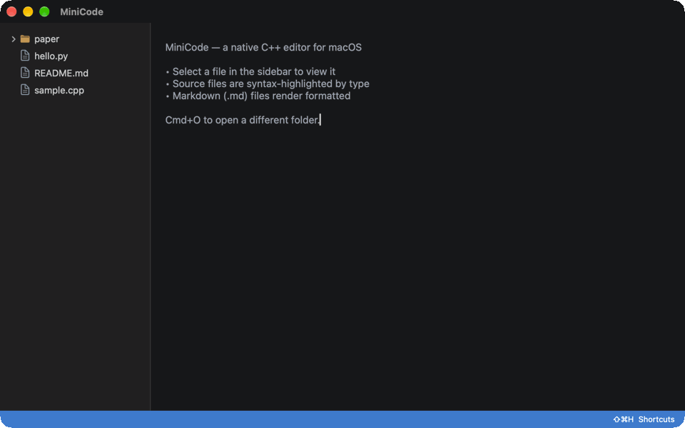
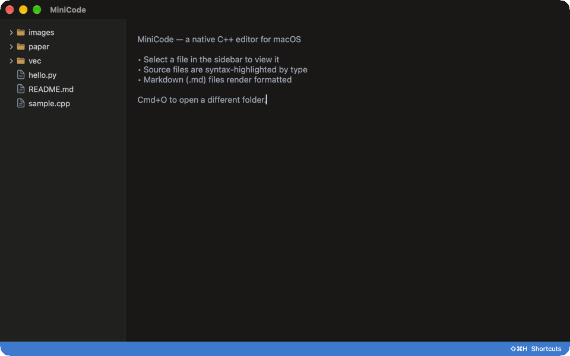
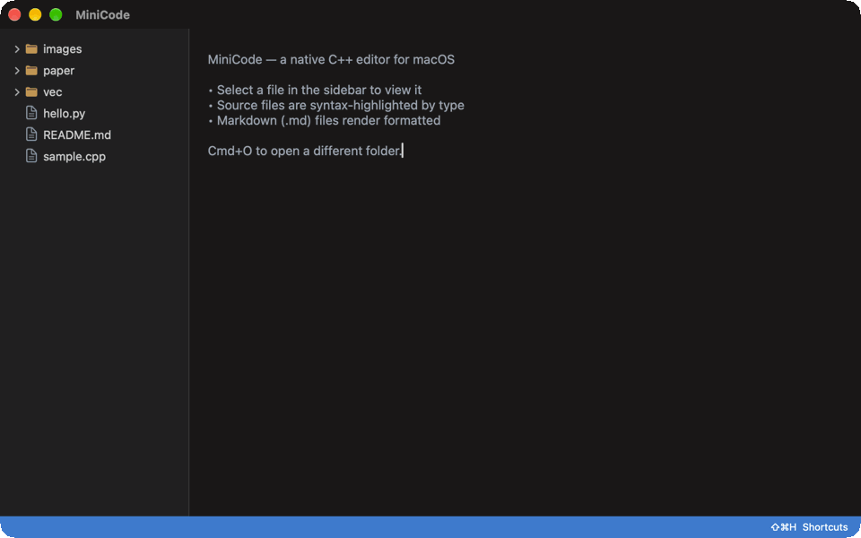
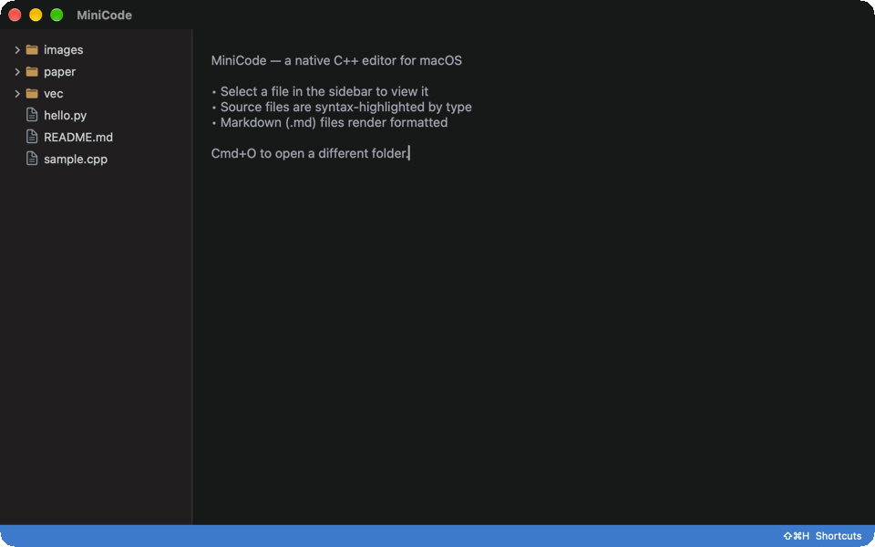
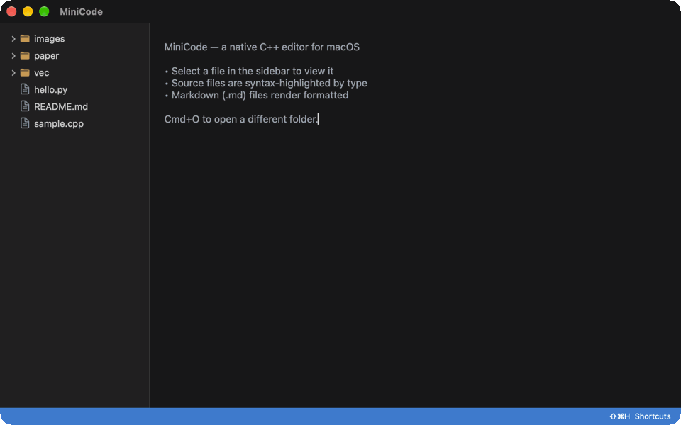
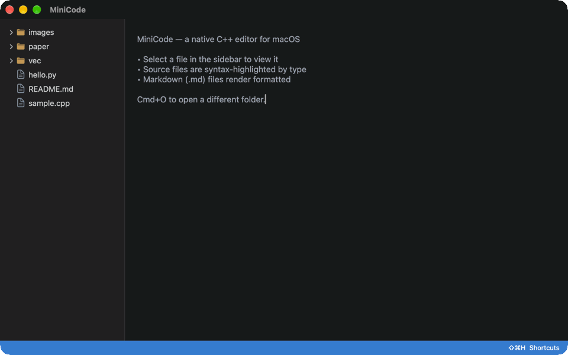
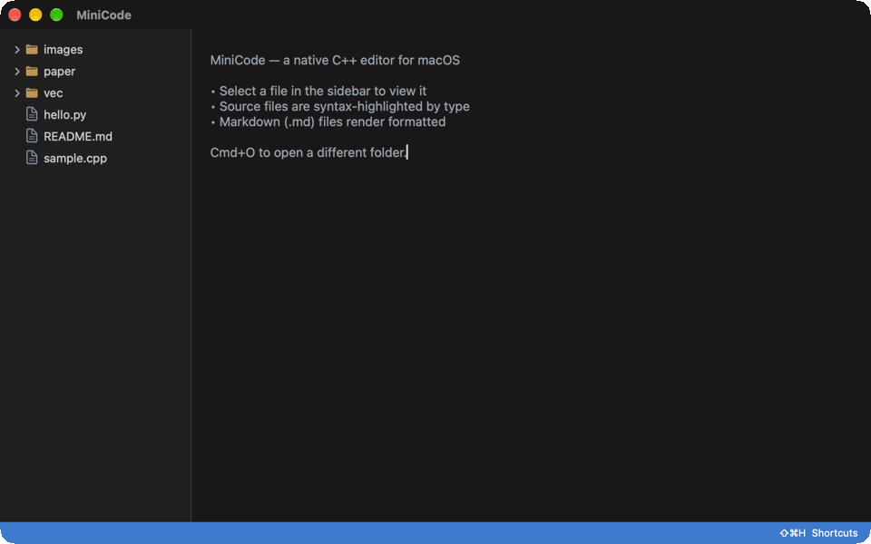
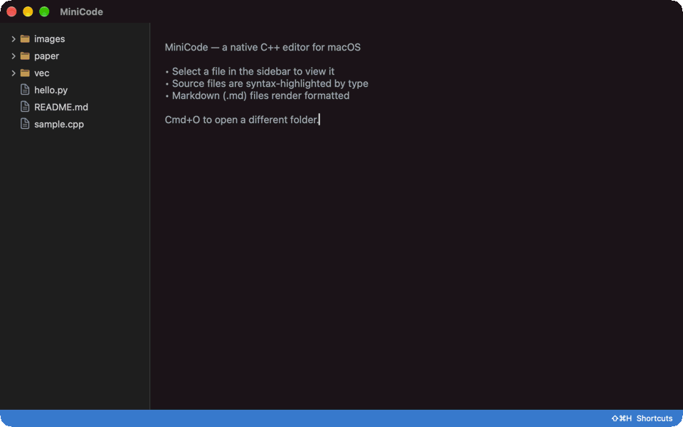

# minicode

minicode is a 1.7 MB editor with a terminal, a browser, a file tree, and a Markdown and LaTeX preview in one window, all driven from the keyboard. It's written from scratch in C++, with no Electron and no third-party dependencies, and runs on macOS, Linux, and Android.



```
brew install --cask e-c-hansen/tap/minicode
```

The [Linux](#linux) and [Android](#android) builds are further down.

I built it because I wanted one light place to browse a folder, edit code with a language server behind it, preview Markdown and LaTeX, and keep a terminal and a browser a keystroke away, without a few hundred megabytes of runtime underneath.

The macOS app links only against frameworks that ship with the system. The Linux version is a GTK4 port and the Android version is a Kotlin app; all three share the same C++ core. The rest of this README describes the macOS app, and the Linux and Android sections say how the others differ.

## What it does

Open a folder and you get a file tree on the left and the file you click in the main pane. The tree follows changes made elsewhere, in the terminal, in git or in another program, and right clicking an item offers new file, new folder, rename, move to trash, reveal in Finder and copy path.

Source files are highlighted by extension: Python, the C family, JavaScript, TypeScript, JSON, shell, LaTeX and a few others. Markdown renders as formatted text, with working links, tables and images, and Shift Command P flips to the source. Pictures with an https address, such as the badges at the top of a README, are downloaded in the background and kept in memory only; markdown.web-images = false in the settings turns that off. Math written as on GitHub, $x^2$ inline and $$ or a math code block for a display, is typeset by tectonic (the LaTeX preview's engine, below) in the background and kept in a cache, so a page opened again shows its formulas at once; markdown.math = false shows them as their TeX instead. You can also edit the rendered page: double click a paragraph, heading, list item or table cell, and a small editor opens holding its Markdown. Images and PDFs open in the same pane, and reload when the file changes on disk. On the Mac so do video and audio files, such as mp4, mov, mp3, wav and flac, in the system's own player; nothing plays until you press Shift Command Space or the play button.



Markdown task lists make a TODO list, written the way GitHub, Obsidian, and VS Code read them: `- [ ] buy milk` is a task still to do and `- [x] buy milk` one that is done. In the preview each task has a box you click (or tap, on Android) to tick or clear it. The file then has unsaved changes, as after any edit made in the preview, until you save it. Done tasks are greyed out and struck through (markdown.done in the settings sets their color), and the title bar says how many of the file's tasks are done. In the source, Command L (Ctrl L on Linux) turns the line, or every selected line, into a task, ticks it if it already is one, and clears it if it was ticked. A line written as `[ ] buy milk`, without the dash, is not a task to GitHub or to minicode and shows as plain text, so select such lines and press Command L once: each gets its dash and keeps its box. Return at the end of a list item starts the next item, with an empty box after a task and the next number after a numbered one, and Return on an empty item ends the list. Shift Command L (Ctrl Shift L on Linux, the leader key and then W on Android) lists every TODO, FIXME, HACK, XXX, and BUG comment in the folder, along with the open tasks in its Markdown files, and opens the one you pick at its line.

Control backtick opens a terminal at the bottom. It runs one persistent zsh with your own startup files, so aliases, history and state carry over from one command to the next, and colors come through. When a program wants the whole screen (vim, less, htop, git log's pager, ssh), the panel becomes a character grid until it exits.





Paths and URLs in the output are links. Command click src/main.cpp:42:7 from a compiler, or a file Claude Code mentions, and it opens at that line; a URL opens in the browser panel, which Shift Command B toggles.



Control Shift G swaps the file tree for a small source control panel, on the Mac, on Linux and on Android (there the leader key and then V, in the file list's place). It shows the branch, how far it is ahead of or behind its upstream, and the changed files in two lists, staged and not yet staged, each with a one letter status. Arrow keys move through the files, Return shows the selected file's diff in the main pane, Space stages or unstages it, and Command Return (Ctrl Enter on Linux) in the message box commits. On the phone a tap on a file shows its diff, the plus or minus beside it stages or unstages it, and the Commit button, or the leader key and then Enter, commits; git runs in Termux there, so the project has to be in the phone's shared storage. Git does the work underneath, and when it refuses something, such as a commit with nothing staged, its own message appears in the panel.

Under the changes is the commit graph: the history of the current branch and its upstream, drawn in colored lanes the way VS Code's graph and `git log --graph` draw them, with branch, remote and tag labels on their commits. Commits you have not pushed yet are tinted blue with a hollow dot and an up arrow, commits on the upstream you have not pulled are tinted green with a down arrow, and a line above the graph says how many of each there are, or that the branch has no upstream. A checkbox shows every local and remote branch instead. The graph loads 200 commits at a time, with a row at the bottom for the next 200. Tab moves between the changes, the graph and the message box, the Down arrow goes from the last changed file into the graph, and Return or a click on a commit shows its author, date, message and diff in the main pane. The panel only reads history; checking out, branching, merging, pulling and pushing are left to the terminal.

Shift Command H lists the shortcuts that apply right now.

## LaTeX

Open a .tex file and minicode typesets it and shows the PDF where the editor sits, again after every change. Shift Command P flips between the page and the source.

You can also edit from the page. Double click some text (a heading, a sentence, a table cell, a list entry, an equation) and a small editor opens holding the LaTeX behind it. Change it, press Return, and only those bytes of your document are replaced, so macros and packages minicode does not understand are left alone. Inside a list it also offers to add an entry. If minicode cannot tell which piece of source a word came from, it opens nothing rather than the wrong text. Nothing is written to disk until you press Command S, and Shift Command S exports the PDF.



Typesetting is done by [tectonic](https://tectonic-typesetting.github.io/). If it is not installed, the preview offers to download it (about 22 MB), or you can run brew install tectonic. The first document downloads the packages it needs, and after that it works offline.

## Language servers

With a language server installed, minicode gives you completion, errors as you type, hover and go to definition. It knows clangd (C, C++, Objective-C), pyright or pylsp (Python), gopls (Go), rust-analyzer (Rust) and typescript-language-server (JavaScript and TypeScript), and finds them on your PATH and in the usual Homebrew, Cargo and Go folders.

Problems get a red or yellow squiggle, and the status bar counts them. Typing a dot, an arrow or a double colon opens completion, and Control Space opens it anywhere. F12 or Command click jumps to a definition, and Command I shows the type and documentation under the cursor.



The settings file can pick a different server or turn one off (lsp.python = pylsp, lsp.go = off, lsp.enabled = false).

## Settings and transparency

Command comma opens ~/.config/minicode/settings.conf, written the first time with every setting listed and commented out. Changes apply as soon as the file is saved. Each panel has its own background color, opacity and text color; opacity applies only to the background, so text stays solid, and window.blur frosts what is behind the window. Syntax and Markdown colors can be changed too.

```
window.blur = true
editor.opacity = 70%
sidebar.opacity = 0.5
terminal.text = #E0E0E0
```

Every color in the file shows as a swatch, and clicking one opens the color picker; the window follows along as you drag. A line with a mistake is ignored, and the status bar says which one and why.



## Memory

The benchmark is a simple workload on this repository: clangd on a C++ file, some work in the terminal, typesetting a LaTeX document, and loading a Wikipedia page. The numbers are the RAM footprint on an M3 Mac, measured after a minute of settling:

|   | Memory |
| --- | --- |
| minicode | 320 MB |
| VS Code, Chrome and Preview | 1,283 MB |

Both sides run the same clangd. make membench reproduces it on scratch profiles. On disk, MiniCode.app is 1.7 MB and Visual Studio Code.app is 659 MB.

## Next to VS Code and Zed

minicode isn't VS Code or Zed, but I use it every day. Hotkeys alone move between writing code, running it in the terminal and reading GitHub in the browser pane. I edited my own resume in it, in LaTeX, and Claude Code runs fine in its terminal. It leaves out a good deal that VS Code and Zed offer, mostly to keep the footprint small: rename and find references, formatting and code actions, a debugger, tabs and split editors, extensions, and an AI assistant built into the editor. The git panel is small on purpose. It shows status, diffs and the commit graph with what is and isn't pushed, stages and unstages files, and commits, while checking out branches, merging and pushing stay in the terminal. For those, VS Code or Zed is the better choice.

Zed set out with a similar goal, a lighter and more usable IDE, and it does much of what minicode does. As of Zed 1.15 it has no built-in browser, which has been an open [feature request](https://github.com/zed-industries/zed/issues/10533) since 2024. LaTeX goes through an [extension](https://github.com/rzukic/zed-latex/wiki/Preview) that builds the PDF and shows it in a separate viewer such as Skim, with SyncTeX jumps between the two. VS Code works the same way, through extensions and outside viewers. minicode builds the browser, the PDF viewer and the LaTeX preview into the window instead, and text on the typeset page can be edited where it is.

| | minicode | Zed | VS Code |
| --- | --- | --- | --- |
| Language server | completion, diagnostics, hover, definition | full | full |
| Browser in the window | yes | no | a basic one |
| LaTeX | typeset in the window, edit on the page | extension, external PDF viewer | extension, PDF in a tab |
| Git | status, diffs, staging, committing and a read-only commit graph (macOS, Linux, and Android through Termux); branches, merges and pushing in the terminal | full | full |
| Debugger | no | yes | yes |
| Extensions | no | yes | yes |
| Platforms | macOS, Linux, Android | macOS, Linux, Windows | macOS, Linux, Windows |

## Installing and building

```
brew install --cask e-c-hansen/tap/minicode
```

The app is not notarized, since that needs a paid Apple Developer account, so the cask clears the quarantine flag and it opens without a Gatekeeper warning. The install also puts a minicode command on your PATH: give it a folder or a file, or nothing for the current directory. In Finder, Open With offers minicode for text and source files, Markdown, LaTeX, images, PDFs, video, audio and folders, and you can drop any of them on its Dock icon. A file opens in the window whose folder already holds it, or else in a new window on the file's folder. minicode never makes itself the default app for a kind of file; pick it under Open With in Finder's Get Info if you want a double click to use it.

To build it yourself you need only the Xcode command line tools.

```
git clone https://github.com/e-c-hansen/minicode.git
cd minicode
make
```

The demo folder has a Python file, C++, Markdown, a short LaTeX paper in demo/paper and a two file C++ example in demo/vec for trying clangd. make test runs the unit tests of the shared core. To run it:

```
make run DIR=demo
```

## Linux

The Linux version, in the linux folder, is built on GTK4 with a VTE terminal, a WebKitGTK browser and poppler for PDFs. It has everything described above, including the LaTeX preview and language servers, with Control where the Mac uses Command. What it lacks is typeset math in the Markdown preview, which shows the TeX for now, and blur behind the window, which GNOME gives applications no way to ask for.

Video and audio files play in the editor's pane through GTK's own GStreamer support. A stock Ubuntu plays WebM, Ogg, MP3 and FLAC out of the box; H.264 video and AAC audio, which most .mp4 and .m4a files hold, need `sudo apt install gstreamer1.0-libav`, and minicode says so when it meets one.

```
sudo apt install build-essential meson libgtk-4-dev \
    libvte-2.91-gtk4-dev libwebkitgtk-6.0-dev libpoppler-glib-dev pkg-config
cd linux
meson setup build
meson compile -C build
```

To run the demo:

```
./build/minicode ../demo
```

You can alias the local build, if you'd like:

```
alias minicode="$PWD/build/minicode"
```


[BUILD-LINUX.md](BUILD-LINUX.md) covers installing it as a desktop app and which shortcuts go to the terminal.

## Android

The Android port is made for phones with a physical keyboard, such as the Unihertz Titan 2 Elite. It's built around the same C++ core and offers approximately the same functionality: file tree, editor with syntax highlighting, images and PDF rendering, video and audio in Android's own player, a browser pane, and a terminal on a real shell, including all the special characters you need. The Markdown preview is the desktop's: links you can tap, real tables, pictures with GIFs playing, and a double tap on a paragraph, heading, list item, quote, code block or table cell opens a small box holding its Markdown to edit. Pictures with an https address are downloaded as on the desktop; since Android has no settings file, Web images in Markdown in the ⋮ menu turns that off. You can even tap links in the terminal for specific lines within files and go straight to them, like "main.cpp:42:7". The keyboard shortcuts work here too, so the browser, the editor, the file list and the terminal are each a key away. It feels like a tiny operating system.

With [Termux](https://f-droid.org/packages/com.termux/) installed, the terminal is Termux's own bash, in the folder you have open, so python, git, clang and anything else you installed with pkg run there, and vim, less and the Python prompt get a real terminal. Without Termux it is the phone's own shell, which has the basic file tools and nothing more. Termux also runs your language servers (clangd, pylsp and the rest) for squiggles, completion, hover and go to definition, typesets LaTeX with tectonic, including double tapping the page to edit the source behind it, and runs git for the same source control panel and commit graph the desktop has. The file list keeps up with the disk, so a file made in the terminal shows up in it straight away.

To install it, download MiniCode-*version*.apk from the [latest release](https://github.com/e-c-hansen/minicode/releases/latest) on your phone and open it; Android asks once whether your browser may install apps. [Obtainium](https://github.com/ImranR98/Obtainium) can install it from this repository's releases and keep it updated. It is not on the Play Store. [android/README.md](android/README.md) covers setting up Termux, the keyboard shortcuts, and building it yourself.

## Keyboard shortcuts

A blank cell means that port does not have the action yet. On Android, a letter alone means the leader key and then that letter, because a phone keyboard often has no Control: on a Unihertz Titan 2 the leader is the unlabelled key left of the right Shift, and elsewhere the Menu key. A held Ctrl works too, on a USB or Bluetooth keyboard or a phone whose Fn key is set to act as Ctrl. While the terminal has the keyboard, Ctrl and a letter go to the shell, so add Shift there. [android/README.md](android/README.md) has the rest.

| Action | macOS | Linux | Android |
| --- | --- | --- | --- |
| Browse the file tree and open the selected file | Up, Down, Return | Up, Down, Enter; Left and Right close and open folders |  |
| Close the application | Shift Command W | Ctrl Q |  |
| Close the window | Command W | Ctrl W |  |
| Comment or uncomment the selected lines | Command / | Ctrl / |  |
| Complete the word at the cursor, with a language server | Control Space, or Option Escape | Ctrl Space | N, or Ctrl N |
| Export the typeset PDF of a LaTeX file | Shift Command S | Ctrl Shift S |  |
| Find across the whole folder | Shift Command F | Ctrl Shift F |  |
| Find in the current file | Command F | Ctrl F |  |
| Find next, find previous | Command G, Shift Command G | Ctrl G or F3, Shift F3 |  |
| Focus the editor, or the player when a video or audio file is open | Command 1 | Ctrl 1 |  |
| Focus the file tree | Command 0 | Ctrl 0 |  |
| Go to definition | F12, or Command click (F12 may need fn on a laptop) | F12, or Ctrl click | G, or Ctrl G |
| Jump to the previous file | Control Tab | Ctrl Tab |  |
| List the TODO comments and open Markdown tasks in the folder | Shift Command L | Ctrl Shift L | W, or Ctrl Shift L |
| Move the selected file to the Trash | Command Delete | Delete, in the file tree |  |
| New file | Control Command N | Ctrl Alt N | New file in the ⋮ menu |
| New folder | Shift Command N | Ctrl Shift N |  |
| New window | Command N | Ctrl N |  |
| Open a file or URL named in the terminal, such as src/main.cpp:42:7 | Command click it | Ctrl click it | Tap it |
| Open a folder | Command O | Ctrl O | O, or Ctrl O |
| Open the settings file | Command comma | Ctrl comma |  |
| Play or pause a video or audio file | Shift Command Space | Ctrl Shift Space | Space in the player, or Ctrl Shift Space |
| Refresh the file tree | Command R |  |  |
| Rename the selected file or folder |  | F2, in the file tree |  |
| Save | Command S | Ctrl S | S, or Ctrl S |
| Show or hide dotfiles | Shift Command . | Ctrl H, or Ctrl Shift . |  |
| Show or hide the on-screen keyboard, for symbols the phone's keyboard lacks |  |  | Y, or the keyboard button in the title bar |
| Show the type and documentation under the cursor | Command I | Ctrl I | K, or Ctrl K |
| Tick or clear a Markdown task, or make the selected lines tasks | Command L, or click its box in the preview | Ctrl L, or click its box in the preview | L, or Ctrl L, or tap its box in the preview |
| Toggle the browser | Shift Command B | Ctrl Shift B | B, or Ctrl Shift B |
| Toggle the editor, giving its space to the terminal and browser | Shift Command E | Ctrl Shift E |  |
| Toggle the file list or sidebar | Command B | Ctrl B | F, or Ctrl B or Ctrl F |
| Toggle the preview of a Markdown or LaTeX file | Shift Command P | Ctrl Shift P | P, or Ctrl P |
| Toggle the shortcut hints | Shift Command H | Ctrl Shift H | H, or Ctrl H |
| Toggle the source control panel in place of the file tree | Control Shift G | Ctrl Shift G | V, or Ctrl Shift G |
| Toggle the terminal | Shift Command T, or Control backtick | Ctrl Shift T, or Ctrl backtick | T, or Ctrl T |
| Undo, redo | Command Z, Shift Command Z | Ctrl Z, Ctrl Shift Z | U, R, or Ctrl Z, Ctrl Shift Z (Ctrl U, Ctrl R also work) |
| Zoom a PDF or the LaTeX preview in or out |  | Ctrl plus (or Ctrl equals), Ctrl minus, Ctrl with the scroll wheel, or a pinch on the touchpad |  |
| Zoom a PDF or the LaTeX preview back to the width of the pane |  | Ctrl Alt 0 |  |

## Limitations

minicode does what I use every day and leaves out a good deal. The terminal does not pass mouse clicks to full screen programs, and has no scrollback while a program has the grid. The Markdown preview follows GitHub's rules for emphasis, links, lists, quotes and tables, but only a handful of HTML tags mean anything to it, and on Linux and Android math shows as its TeX. In the LaTeX preview, text produced inside your own macro definitions cannot be edited from the page. The language server client has no rename, find references, formatting or code actions yet.

## License

MIT.
